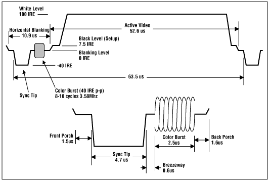

# ScopeTV
The purpose of was to take the NTSC output from a DVD player and display the video on an oscilloscope using the XY mode, and have the audio be output using a speaker. 

## NTSC Signal

    - This image was sourced from Analog Devices' [website](https://www.analog.com/en/resources/technical-articles/basics-of-analog-video.html).
- In order to understand the block diagram, it is critical to understad how the NTSC signal is structured. 
- The dips in the signal is the Horizontal Syncs (HSync), while the actual video is being sent while the signal is high.
    - The Vertical Syncs (VSync) are also sent similarly except the signal dips for much longer than the horizontal sync.
- The color is transmitted using a much high frequency signal, which is known as a Color Burst.

## Block Diagram
### Video Output
- First the NTSC signal is taken from the DVD player. Signal is split into two paths where one path is used for the Z-axis, and other path is for the X,Y-axis.
- The Z-axis is generated using an inverted summing amplifier. 
    - An inverted amplifier was used since the non-inverted signal would make the final image flipped. 
    - The summing part of the amplifier helps to provide a DC bias to the signal to make the overall display brighter.
    - By adjusting the gain of the amplifier, the contrast can be adjusted as well.
- For the X,Y-axis output, the NTSC was first sent through a LPF to remove the high frequency ripples in the waveform which contained the information about the color, Since the final output was going to be black and white, this color information would made the signal processing a lot more difficult.
- Afterwards, the signal was given a DC bias so the entire waveform would have a positive voltage (DC Restorer), and was fed through a comparator to track when the NTSC was transmitting data and when it was sending a new horizontal line, or HSync.
- The signal was split once again between the X-axis and the Y-axis.
    - After every horizontal line was sent, there was a Horizontal Ramp Generator that would slowly increase the voltage from 0 to VDD linearly which would be sent to the X-axis.
- For the Y-axis, there was a little more processing left.
    - The comparator output would be sent through a LPF to act as an integrator in this scenario. This is because a vertical frame is similarly sent the same way as a horizontal line, except the time the voltage was higher than the comparator value was longer, which is also known as the VSync. 
    - By utilizing a LPF, it would ensure the signal was high for a set duration of time that was expected for the vertical frame, and not a horizontal line, so the vertical frames can be detected.
    - This detection was done using another comparator, which was sent through a Vertical Ramp Generator, which was finally sent to the Y-Axis.

### Audio Output
- The audio output was generated much more simply by utilizing the LM386 which is an audio amplifier.
- Following the datasheet and after testing the output, the final gain for the audio amplifier was set to 200dB